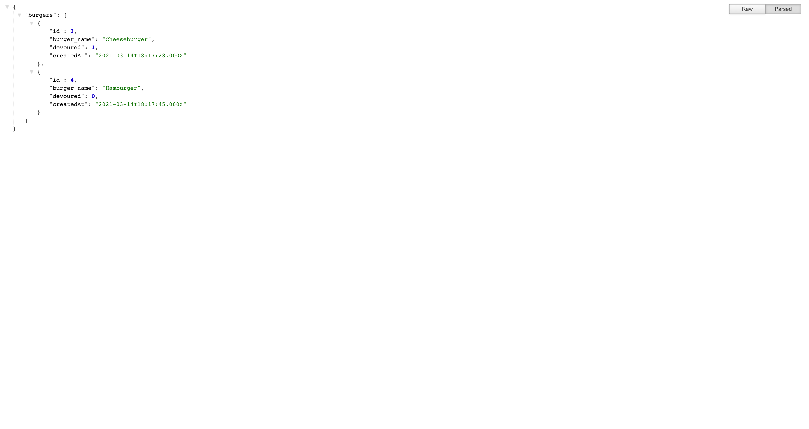
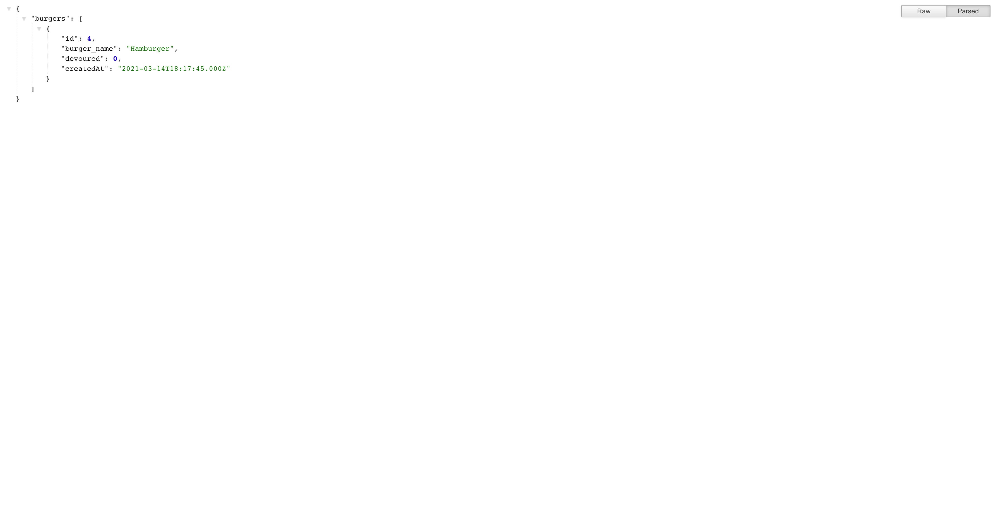

# Employee Tracker

## Table of Contents: 
- [Description](#description)
- [Installation](#installation)
- [User Story](#user-story)
- [Contributing](#contributing)
- [Tests](#tests)
- [License](#license)
- [Questions](#questions)
<hr>

## Description: 
Being able to track new burgers you want to try or plan on eating and keeping track of whether they were eaten or not is important. This application can serve as a template for a variety of tracking purposes. With the ability to add a new entry to the database, update the database item via changing it to devoured, and delete the item completely, you are presented with a CRUD approach application. This project is deployed on Heroku and utilized MySQL for backend database connection. 

<p>Find the deployed project at <a href="https://burger-logger-kolton-decker.herokuapp.com/">https://burger-logger-kolton-decker.herokuapp.com/</a>.</p>

<p>Find the source code at <a href="https://github.com/koltondecker/burger-logger">https://github.com/koltondecker/burger-logger</a>.</p>

<p><a href="https://www.npmjs.com/package/mysql">MYSQL</a> was used for this project.</p>
<p><a href="https://www.npmjs.com/package/dotenv">DOTENV</a> was used for this project.</p>
<p><a href="https://www.npmjs.com/package/util">UTIL</a> was used for this project.</p>
<p><a href="https://www.npmjs.com/package/express">Express</a> was used for this project.</p>
<p><a href="https://www.npmjs.com/package/express-handlebars">Express Handlebars</a> was used for this project.</p>

### Landing Page
<br>

<hr>

### Adding a Cheeseburger
<br>

<hr>

### Adding a Hamburger
<br>

<hr>

### Eating Cheeseburger
<br>

<hr>

### API Database of All Burgers
<br>

<hr>

### Delete Cheeseburger
<br>

<hr>

### API Database After Deleting Cheeseburger
<br>


<hr>

## Installation: 
Upon downloading the files from this repo, use 'npm init' to initialize npm package and 'npm i' to install necessary dependencies for this project.
<hr>

## User Story

```
As a consumer
I want to be able to add burgers to a list, show when I've devoured a burger and delete burgers
So that I can organize my burger eating history
```


## Acceptance Criteria

```
GIVEN an burger eating tracking application
WHEN I add a new burger
THEN I am presented with a list of 'Ready to be Eaten' burgers
WHEN I click on a button to eat a burger
THEN I am presented with a list of 'Devoured' burgers
WHEN I click to delete a burger on the devoured list
THEN the list updates to no longer include that item
WHEN I route to /api/burgers
THEN I am presented with a JSON object array of all burgers in the database
```
<hr>

## Contributing: 
Feel free to contribute to this project in whatever ways you see beneficial. I will review pull requests and update with appropriate additions.
<hr>

## Tests: 
No tests were used for this project.
<hr>

### License: 
No license was used for this project. 
<hr>

### Questions: 
<p>If you would like to learn more, please take a look through my github below:</p>
<p><a href="https://github.com/koltondecker"> </a>Visit my GitHub at <a href="https://github.com/koltondecker">github.com/koltondecker</a></p>
<p>If you still have questions, please send me an email and I will respond as soon as I can:</p>
<p><a href="mailto:deckerman25@gmail.com">deckerman25@gmail.com</a></p>